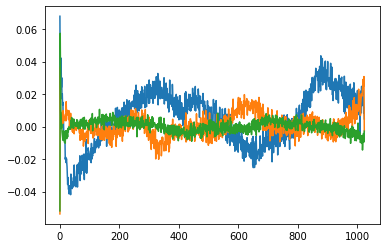
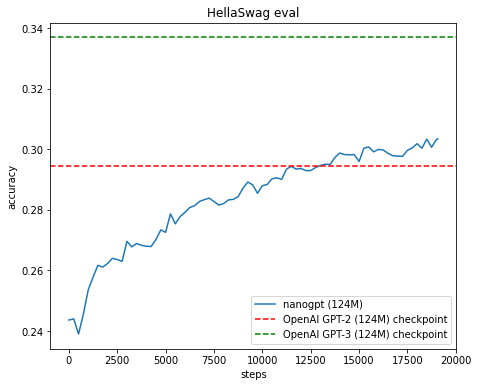

```python
from transformers import GPT2LMHeadModel

model_hf = GPT2LMHeadModel.from_pretrained("gpt2")
sd_hf = model_hf.state_dict()

for k, v in sd_hf.items():
    print(k, v.shape)
```

    transformer.wte.weight torch.Size([50257, 768])
    transformer.wpe.weight torch.Size([1024, 768])
    transformer.h.0.ln_1.weight torch.Size([768])
    transformer.h.0.ln_1.bias torch.Size([768])
    transformer.h.0.attn.c_attn.weight torch.Size([768, 2304])
    transformer.h.0.attn.c_attn.bias torch.Size([2304])
    transformer.h.0.attn.c_proj.weight torch.Size([768, 768])
    transformer.h.0.attn.c_proj.bias torch.Size([768])
    transformer.h.0.ln_2.weight torch.Size([768])
    transformer.h.0.ln_2.bias torch.Size([768])
    transformer.h.0.mlp.c_fc.weight torch.Size([768, 3072])
    transformer.h.0.mlp.c_fc.bias torch.Size([3072])
    transformer.h.0.mlp.c_proj.weight torch.Size([3072, 768])
    transformer.h.0.mlp.c_proj.bias torch.Size([768])
    transformer.h.1.ln_1.weight torch.Size([768])
    transformer.h.1.ln_1.bias torch.Size([768])
    transformer.h.1.attn.c_attn.weight torch.Size([768, 2304])
    transformer.h.1.attn.c_attn.bias torch.Size([2304])
    transformer.h.1.attn.c_proj.weight torch.Size([768, 768])
    transformer.h.1.attn.c_proj.bias torch.Size([768])
    transformer.h.1.ln_2.weight torch.Size([768])
    transformer.h.1.ln_2.bias torch.Size([768])
    transformer.h.1.mlp.c_fc.weight torch.Size([768, 3072])
    transformer.h.1.mlp.c_fc.bias torch.Size([3072])
    transformer.h.1.mlp.c_proj.weight torch.Size([3072, 768])
    transformer.h.1.mlp.c_proj.bias torch.Size([768])
    transformer.h.2.ln_1.weight torch.Size([768])
    transformer.h.2.ln_1.bias torch.Size([768])
    transformer.h.2.attn.c_attn.weight torch.Size([768, 2304])
    transformer.h.2.attn.c_attn.bias torch.Size([2304])
    transformer.h.2.attn.c_proj.weight torch.Size([768, 768])
    transformer.h.2.attn.c_proj.bias torch.Size([768])
    transformer.h.2.ln_2.weight torch.Size([768])
    transformer.h.2.ln_2.bias torch.Size([768])
    transformer.h.2.mlp.c_fc.weight torch.Size([768, 3072])
    transformer.h.2.mlp.c_fc.bias torch.Size([3072])
    transformer.h.2.mlp.c_proj.weight torch.Size([3072, 768])
    transformer.h.2.mlp.c_proj.bias torch.Size([768])
    transformer.h.3.ln_1.weight torch.Size([768])
    transformer.h.3.ln_1.bias torch.Size([768])
    transformer.h.3.attn.c_attn.weight torch.Size([768, 2304])
    transformer.h.3.attn.c_attn.bias torch.Size([2304])
    transformer.h.3.attn.c_proj.weight torch.Size([768, 768])
    transformer.h.3.attn.c_proj.bias torch.Size([768])
    transformer.h.3.ln_2.weight torch.Size([768])
    transformer.h.3.ln_2.bias torch.Size([768])
    transformer.h.3.mlp.c_fc.weight torch.Size([768, 3072])
    transformer.h.3.mlp.c_fc.bias torch.Size([3072])
    transformer.h.3.mlp.c_proj.weight torch.Size([3072, 768])
    transformer.h.3.mlp.c_proj.bias torch.Size([768])
    transformer.h.4.ln_1.weight torch.Size([768])
    transformer.h.4.ln_1.bias torch.Size([768])
    transformer.h.4.attn.c_attn.weight torch.Size([768, 2304])
    transformer.h.4.attn.c_attn.bias torch.Size([2304])
    transformer.h.4.attn.c_proj.weight torch.Size([768, 768])
    transformer.h.4.attn.c_proj.bias torch.Size([768])
    transformer.h.4.ln_2.weight torch.Size([768])
    transformer.h.4.ln_2.bias torch.Size([768])
    transformer.h.4.mlp.c_fc.weight torch.Size([768, 3072])
    transformer.h.4.mlp.c_fc.bias torch.Size([3072])
    transformer.h.4.mlp.c_proj.weight torch.Size([3072, 768])
    transformer.h.4.mlp.c_proj.bias torch.Size([768])
    transformer.h.5.ln_1.weight torch.Size([768])
    transformer.h.5.ln_1.bias torch.Size([768])
    transformer.h.5.attn.c_attn.weight torch.Size([768, 2304])
    transformer.h.5.attn.c_attn.bias torch.Size([2304])
    transformer.h.5.attn.c_proj.weight torch.Size([768, 768])
    transformer.h.5.attn.c_proj.bias torch.Size([768])
    transformer.h.5.ln_2.weight torch.Size([768])
    transformer.h.5.ln_2.bias torch.Size([768])
    transformer.h.5.mlp.c_fc.weight torch.Size([768, 3072])
    transformer.h.5.mlp.c_fc.bias torch.Size([3072])
    transformer.h.5.mlp.c_proj.weight torch.Size([3072, 768])
    transformer.h.5.mlp.c_proj.bias torch.Size([768])
    transformer.h.6.ln_1.weight torch.Size([768])
    transformer.h.6.ln_1.bias torch.Size([768])
    transformer.h.6.attn.c_attn.weight torch.Size([768, 2304])
    transformer.h.6.attn.c_attn.bias torch.Size([2304])
    transformer.h.6.attn.c_proj.weight torch.Size([768, 768])
    transformer.h.6.attn.c_proj.bias torch.Size([768])
    transformer.h.6.ln_2.weight torch.Size([768])
    transformer.h.6.ln_2.bias torch.Size([768])
    transformer.h.6.mlp.c_fc.weight torch.Size([768, 3072])
    transformer.h.6.mlp.c_fc.bias torch.Size([3072])
    transformer.h.6.mlp.c_proj.weight torch.Size([3072, 768])
    transformer.h.6.mlp.c_proj.bias torch.Size([768])
    transformer.h.7.ln_1.weight torch.Size([768])
    transformer.h.7.ln_1.bias torch.Size([768])
    transformer.h.7.attn.c_attn.weight torch.Size([768, 2304])
    transformer.h.7.attn.c_attn.bias torch.Size([2304])
    transformer.h.7.attn.c_proj.weight torch.Size([768, 768])
    transformer.h.7.attn.c_proj.bias torch.Size([768])
    transformer.h.7.ln_2.weight torch.Size([768])
    transformer.h.7.ln_2.bias torch.Size([768])
    transformer.h.7.mlp.c_fc.weight torch.Size([768, 3072])
    transformer.h.7.mlp.c_fc.bias torch.Size([3072])
    transformer.h.7.mlp.c_proj.weight torch.Size([3072, 768])
    transformer.h.7.mlp.c_proj.bias torch.Size([768])
    transformer.h.8.ln_1.weight torch.Size([768])
    transformer.h.8.ln_1.bias torch.Size([768])
    transformer.h.8.attn.c_attn.weight torch.Size([768, 2304])
    transformer.h.8.attn.c_attn.bias torch.Size([2304])
    transformer.h.8.attn.c_proj.weight torch.Size([768, 768])
    transformer.h.8.attn.c_proj.bias torch.Size([768])
    transformer.h.8.ln_2.weight torch.Size([768])
    transformer.h.8.ln_2.bias torch.Size([768])
    transformer.h.8.mlp.c_fc.weight torch.Size([768, 3072])
    transformer.h.8.mlp.c_fc.bias torch.Size([3072])
    transformer.h.8.mlp.c_proj.weight torch.Size([3072, 768])
    transformer.h.8.mlp.c_proj.bias torch.Size([768])
    transformer.h.9.ln_1.weight torch.Size([768])
    transformer.h.9.ln_1.bias torch.Size([768])
    transformer.h.9.attn.c_attn.weight torch.Size([768, 2304])
    transformer.h.9.attn.c_attn.bias torch.Size([2304])
    transformer.h.9.attn.c_proj.weight torch.Size([768, 768])
    transformer.h.9.attn.c_proj.bias torch.Size([768])
    transformer.h.9.ln_2.weight torch.Size([768])
    transformer.h.9.ln_2.bias torch.Size([768])
    transformer.h.9.mlp.c_fc.weight torch.Size([768, 3072])
    transformer.h.9.mlp.c_fc.bias torch.Size([3072])
    transformer.h.9.mlp.c_proj.weight torch.Size([3072, 768])
    transformer.h.9.mlp.c_proj.bias torch.Size([768])
    transformer.h.10.ln_1.weight torch.Size([768])
    transformer.h.10.ln_1.bias torch.Size([768])
    transformer.h.10.attn.c_attn.weight torch.Size([768, 2304])
    transformer.h.10.attn.c_attn.bias torch.Size([2304])
    transformer.h.10.attn.c_proj.weight torch.Size([768, 768])
    transformer.h.10.attn.c_proj.bias torch.Size([768])
    transformer.h.10.ln_2.weight torch.Size([768])
    transformer.h.10.ln_2.bias torch.Size([768])
    transformer.h.10.mlp.c_fc.weight torch.Size([768, 3072])
    transformer.h.10.mlp.c_fc.bias torch.Size([3072])
    transformer.h.10.mlp.c_proj.weight torch.Size([3072, 768])
    transformer.h.10.mlp.c_proj.bias torch.Size([768])
    transformer.h.11.ln_1.weight torch.Size([768])
    transformer.h.11.ln_1.bias torch.Size([768])
    transformer.h.11.attn.c_attn.weight torch.Size([768, 2304])
    transformer.h.11.attn.c_attn.bias torch.Size([2304])
    transformer.h.11.attn.c_proj.weight torch.Size([768, 768])
    transformer.h.11.attn.c_proj.bias torch.Size([768])
    transformer.h.11.ln_2.weight torch.Size([768])
    transformer.h.11.ln_2.bias torch.Size([768])
    transformer.h.11.mlp.c_fc.weight torch.Size([768, 3072])
    transformer.h.11.mlp.c_fc.bias torch.Size([3072])
    transformer.h.11.mlp.c_proj.weight torch.Size([3072, 768])
    transformer.h.11.mlp.c_proj.bias torch.Size([768])
    transformer.ln_f.weight torch.Size([768])
    transformer.ln_f.bias torch.Size([768])
    lm_head.weight torch.Size([50257, 768])


```python
import matplotlib.pyplot as plt
%matplotlib inline

plt.plot(sd_hf["transformer.wpe.weight"][:, 255])
plt.plot(sd_hf["transformer.wpe.weight"][:, 200])
plt.plot(sd_hf["transformer.wpe.weight"][:, 155])
```


    [<matplotlib.lines.Line2D at 0x7fd6e3e0a520>]


    

    


```python
import numpy as np
import matplotlib.pyplot as plt
%matplotlib inline

sz = "124M"

loss_baseline = {
    "124M": 3.2924,
}[sz]
hella2_baseline = { # HellaSwag for GPT-2
    "124M": 0.294463,
    "350M": 0.375224,
    "774M": 0.431986,
    "1558M": 0.488946,
}[sz]
hella3_baseline = { # HellaSwag for GPT-3
    "124M": 0.337,
    "350M": 0.436,
    "774M": 0.510,
    "1558M": 0.547,
}[sz]

# load the log file
with open("log/log-train-eval.txt", "r") as f:
    lines = f.readlines()

# parse the individual lines, group by stream (train,val,hella)
streams = {}
for line in lines:
    step, stream, val = line.strip().split()
    if stream not in streams:
        streams[stream] = {}
    streams[stream][int(step)] = float(val)

# convert each stream from {step: val} to (steps[], vals[])
# so it's easier for plotting
streams_xy = {}
for k, v in streams.items():
    # get all (step, val) items, sort them
    xy = sorted(list(v.items()))
    # unpack the list of tuples to tuple of lists
    streams_xy[k] = list(zip(*xy))

# create figure
plt.figure(figsize=(16, 6))

# # Panel 1: losses: both train and val
# plt.subplot(121)
# xs, ys = streams_xy["train"] # training loss
# ys = np.array(ys)
# plt.plot(xs, ys, label=f'nanogpt ({sz}) train loss')
# print("Min Train Loss:", min(ys))
# xs, ys = streams_xy["val"] # validation loss
# plt.plot(xs, ys, label=f'nanogpt ({sz}) val loss')
# # horizontal line at GPT-2 baseline
# if loss_baseline is not None:
#     plt.axhline(y=loss_baseline, color='r', linestyle='--', label=f"OpenAI GPT-2 ({sz}) checkpoint val loss")
# plt.xlabel("steps")
# plt.ylabel("loss")
# plt.yscale('log')
# plt.ylim(top=4.0)
# plt.legend()
# plt.title("Loss")
# print("Min Validation Loss:", min(ys))

# Panel 2: HellaSwag eval
plt.subplot(122)
xs, ys = streams_xy["hella"] # HellaSwag eval
ys = np.array(ys)
plt.plot(xs, ys, label=f"nanogpt ({sz})")
# horizontal line at GPT-2 baseline
if hella2_baseline:
    plt.axhline(y=hella2_baseline, color='r', linestyle='--', label=f"OpenAI GPT-2 ({sz}) checkpoint")
if hella3_baseline:
    plt.axhline(y=hella3_baseline, color='g', linestyle='--', label=f"OpenAI GPT-3 ({sz}) checkpoint")
plt.xlabel("steps")
plt.ylabel("accuracy")
plt.legend()
plt.title("HellaSwag eval")
print("Max Hellaswag eval:", max(ys))
```

    Max Hellaswag eval: 0.3035


    

    


```python

```
